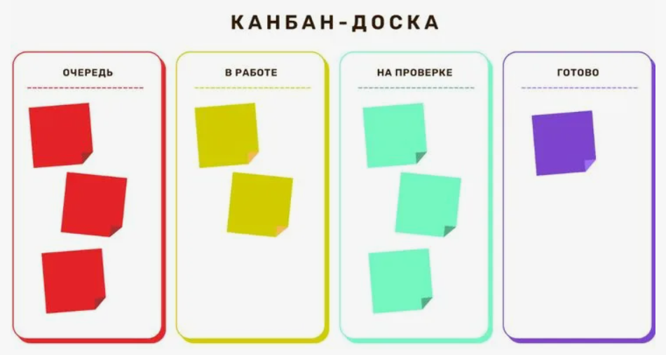

# Информационное пространство: документация пользователя (Нестеров)

<u>ИСПИ:</u> Это справка по приложению **«Информационное пространство»**: доски, списки, карточки задач и чаты.

## Быстрые ссылки
- [Начало работы](#/start/)
- [Доски и списки](#/boards/)
- [Карточки задач](#/boards/cards/)
- [Чаты](#/chat/)
- [FAQ](#/faq/)

## Изображение 

## Изображение-ссылка (сайт GitHub)

## Изображение-ссылка (раздел "Доски")

## Ссылка https://github.com в тексте
[Перейти](https://github.com)